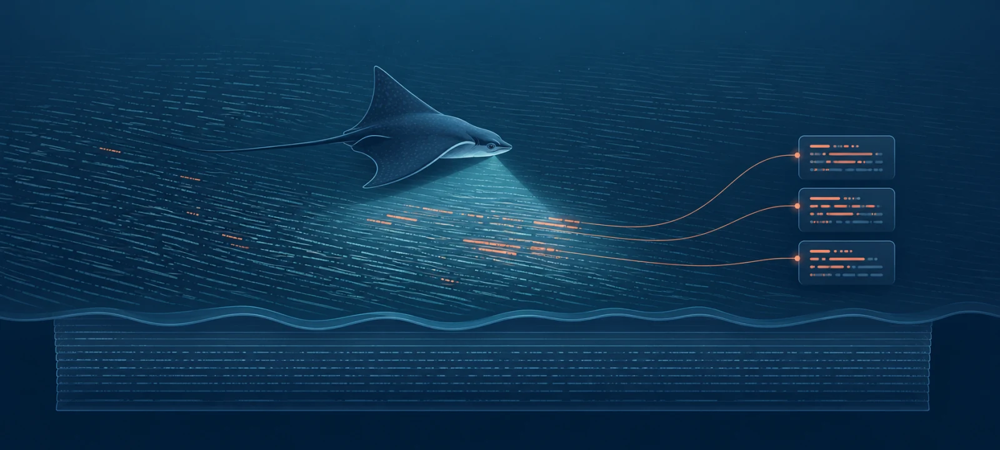

# Gaori



Gaori is an optional local execution and evidence-compression adapter for long or noisy test commands. It preserves the original output and produces compact failure evidence that is easier for people, coding agents, and automation to consume.

Discover the installed command surface without leaving the terminal:

```bash
gaori --help
gaori help run
gaori help rules propose
```

Help requests write plain text to stdout and exit `0`. Invalid commands still fail closed with exit code `2`.

## Why Gaori?

Gaori (가오리) is the Korean word for a ray. Like a ray gliding along the seafloor and searching for food, Gaori scans test logs and surfaces only the failure evidence that matters.

Use it when you want to:

- run a long or noisy project test command without loading its complete output into an LLM conversation context;
- keep a raw log for audit while reviewing a much smaller summary;
- let a coding agent inspect bounded summaries and excerpts before opening sensitive raw output;
- give another tool stable JSON status and evidence paths;
- summarize a log that was produced outside Gaori;
- remove completed standalone evidence after an operator-selected retention period.

Gaori is not a test gate or verification authority. The parent project decides which checks are required and when they run; reviewers or parent workflows decide acceptance. Gaori may wrap a required command, but it does not make that command required. It also never changes a command result: a failing test command remains failed even when no parser recognizes its output.

## Install

Install the current release with Go:

```bash
go install github.com/irootkernel/gaori@v0.1.11
gaori --version
```

From a source checkout, use:

```bash
make install
```

Projects that pin a local Gaori toolchain can install the versioned binary at `~/.local/gaori/toolchains/v0.1.11/bin/`:

```bash
VERSION=0.1.11 make install-toolchain
```

## Optional: configure an AI coding agent

Installing Gaori does not modify a project's `AGENTS.md` and does not install an agent skill. Gaori works normally without either integration. You may use the `AGENTS.md` template below, the reusable skill, both together, or neither: use the `AGENTS.md` block for rules every agent in the repo should always follow, and the skill when you want the full operating procedure loaded only for tasks that actually touch Gaori. The two compose — the `AGENTS.md` block is a deliberate subset of the skill, so using both is duplication, not conflict.

Before pasting the block below, replace `<expected-version>` and `<command-id>` with the project's actual values, add or remove command entries as needed, and replace `gaori` with the project's pinned wrapper command when it uses one. Copy it into the project-wide instruction file supported by your agent runtime, such as `AGENTS.md`:

````markdown
## Gaori test evidence

- The project's own documentation determines which checks are required. Gaori is an optional execution and evidence-compression adapter, not a test gate or acceptance authority. Route a command through Gaori only when its output is long or noisy enough that bounded evidence helps.
- Confirm `gaori` is available and reports `<expected-version>`; do not install it or initialize `.gaori/` automatically. If it is missing or the version differs, run the project's normal documented command instead and report that Gaori evidence compression was unavailable. Use configured commands only when `.gaori/tester.yaml` exists; otherwise use an explicitly chosen tagged ad-hoc run.
- Treat the executed command's exit code as authoritative. Tags select extraction rules, not parsers; a specialized parser that misses never falls back to `generic` and never changes pass/fail. Read `<command-id>.status.json` or structured command output for the result and `extractor_status`, then inspect `<command-id>.summary.md` (or `.summary.json`) and bounded excerpts before opening the potentially unredacted raw log; on a pass, do not open logs at all.
- Keep Gaori runtime state out of Git. Projects may commit `.gaori/tester.yaml` and reviewed `.gaori/tester/rules/*.yaml` so contributors use the same commands and extraction rules; keep toolchain metadata, proposals, run artifacts, and every other `.gaori/` path ignored. Record only claims supported by the current command result and artifacts; Gaori evidence does not establish review acceptance, release, installation, or runtime activation.
- Require explicit user intent before cleanup, cancellation, rule deletion, or reuse of a fixed `--run-id` and command ID that can replace earlier artifacts.
- In the final report, include the Gaori command, process exit code, artifact `status` and `extractor_status`, relevant summary and raw-log paths when opened, and any skipped checks.
````

For task-level operating guidance, use the complete [`use-gaori` skill directory](skills/use-gaori/). In a source checkout, copy it directly after confirming that the destination does not already exist:

```bash
gaori_skill_dir=/path/to/agent/skills/use-gaori
test ! -e "$gaori_skill_dir"
cp -R skills/use-gaori "$gaori_skill_dir"
```

Otherwise fetch it. There is no universal skill-discovery path, so set the destination to the path your agent runtime documents and pin the ref to the release tag whose source ships the skill:

```bash
set -e
: "${GAORI_SKILL_DIR:?set to the documented use-gaori skill directory}"
gaori_skill_ref=v0.1.11
mkdir -p "$GAORI_SKILL_DIR/references"
curl -fsSLo "$GAORI_SKILL_DIR/SKILL.md" \
  "https://raw.githubusercontent.com/irootkernel/gaori/$gaori_skill_ref/skills/use-gaori/SKILL.md"
for reference in lifecycle authoring recovery; do
  curl -fsSLo "$GAORI_SKILL_DIR/references/$reference.md" \
    "https://raw.githubusercontent.com/irootkernel/gaori/$gaori_skill_ref/skills/use-gaori/references/$reference.md"
done
ls "$GAORI_SKILL_DIR"/SKILL.md "$GAORI_SKILL_DIR"/references/*.md
```

The skill is source-distributed in the v0.1.11 GitHub source archive. `go install`, `make install`, and `make install-toolchain` install only the Gaori binary and do not copy or activate the skill.

## Try it in five minutes

The following disposable command intentionally fails so you can see the evidence Gaori creates. Run it from any temporary directory:

```bash
mkdir -p .gaori
cat > .gaori/tester.yaml <<'YAML'
version: 2
commands:
  demo:
    command: ["sh", "gaori-demo-test.sh"]
    tags: [demo, unit]
    parser: generic
    timeout_sec: 30
redaction:
  patterns:
    - name: token
      regex: 'token=[^ ]+'
      replace: 'token=<redacted>'
YAML

cat > gaori-demo-test.sh <<'SH'
#!/bin/sh
echo 'TypeError: token=secret failed'
echo 'src/demo.test.ts:12:3'
echo '✗ renders the demo'
exit 1
SH
chmod +x gaori-demo-test.sh
```

Run the configured command:

```bash
gaori run demo
```

The command exits `1`, and Gaori prints the paths of the generated evidence. Open the latest human-readable summary:

```bash
latest_run="$(ls -dt .gaori/runs/standalone/* | head -1)"
sed -n '1,120p' "$latest_run/demo.summary.md"
```

The summary contains `token=<redacted>`. The corresponding `demo.raw.log` intentionally retains the original `token=secret` value, so treat raw logs as sensitive local evidence.

## Configure your project

Create `.gaori/tester.yaml` with the commands you want to expose to every contributor. Commands are argv arrays, so no shell quoting is added implicitly. Commit this file when the command definitions, tags, parsers, timeouts, redaction, and noise filters are portable project policy; do not put secrets, absolute paths, or machine-specific arguments in shared config.

Validate the complete config and every stored rule without running a command or creating evidence:

```bash
gaori config check
gaori --json config check
```

The result reports safe command metadata and rule counts; it deliberately omits argv and redaction definitions. It does not verify that configured executables exist or that commands pass.

```yaml
version: 2
commands:
  unit:
    command: ["go", "test", "./..."]
    tags: [go, unit]
    parser: go-test
    timeout_sec: 600
  web:
    command: ["pnpm", "vitest", "run"]
    tags: [unit, web]
    parser: vitest
    timeout_sec: 600
```

Ignore `.gaori/` by default, then re-include only the portable config and reviewed active rules. Replace a blanket `.gaori/` entry in the parent project's `.gitignore` with:

```gitignore
.gaori/*
!.gaori/tester.yaml
!.gaori/tester/
.gaori/tester/*
!.gaori/tester/rules/
.gaori/tester/rules/*
!.gaori/tester/rules/*.yaml
```

This allows Git to track `.gaori/tester.yaml` and direct `.yaml` files under `.gaori/tester/rules/`. It keeps `.gaori/toolchain.yaml`, `.gaori/rule-proposals/`, `.gaori/runs/`, and any other Gaori state ignored. Review active rules before committing them: unlike proposals, they participate in extraction whenever their parser and tags match.

Choose the parser that matches the command output:

| Test output | Parser |
|---|---|
| Other or project-specific text | `generic` |
| Vitest | `vitest` |
| Pytest | `pytest` |
| `go test` | `go-test` |
| Playwright | `playwright` |
| Ginkgo | `ginkgo` |
| Godog | `godog` |
| Cargo test | `cargo-test` |
| Flutter test | `flutter-test` |
| Bun test | `bun-test` |
| Node.js test runner | `node-test` |

Run a configured command by ID:

```bash
gaori run unit
```

Use an ad-hoc command when you do not want to add it to the config:

```bash
gaori run --tag go --tag unit -- go test ./internal/...
```

Ad-hoc runs use `generic` by default. Select an existing specialized parser explicitly when a dynamically chosen command emits a supported test format:

```bash
gaori run --parser go-test --tag go --tag unit -- \
  go test ./internal/usecase/hook -run TestReconcileRewrite -count=1

gaori run --parser pytest --tag python --tag unit -- \
  pytest tests/test_registration.py -k same_version_retry

gaori run --parser vitest --tag web --tag unit -- \
  pnpm vitest run src/session/reducer.test.ts

gaori run --parser playwright --tag web --tag e2e -- \
  pnpm playwright test tests/login.spec.ts
```

For `run`, `--parser` applies only to the tagged ad-hoc `-- <command...>` form; it does not override a configured command. `summarize` also accepts one explicit parser and otherwise defaults to `generic`. Tags select which local extraction rules may inspect a raw log; they do not select the parser or change pass/fail. A rule applies only when its parser matches and all of its tags are present on the run. This lets a `tags: [go]` rule apply to both Go unit and integration runs while a `tags: [go, unit]` rule remains unit-specific. Multiple applicable rules may run against the same log. Specialized parsers use only their own patterns and do not retry generic extraction after a miss.

## Work with existing evidence

Summarize an existing raw log without rerunning its command:

```bash
gaori summarize path/to/unit.raw.log
```

Add repeatable tags when the filename alone does not describe the applicable rule scope:

```bash
gaori summarize --tag go --tag unit path/to/unit.raw.log
```

Select the parser that produced an existing log when it is not generic text:

```bash
gaori summarize --parser ginkgo --tag go --tag unit path/to/ginkgo.raw.log
```

Use `--run-id` when a parent workflow needs a stable run-scoped location:

```bash
gaori --run-id local-check run unit
```

This writes under:

```text
.gaori/runs/scoped/local-check/artifacts/test/
```

For standalone runs, Gaori creates a collision-free directory under `.gaori/runs/standalone/`. Each run contains:

| Artifact | Use |
|---|---|
| `*.summary.md` | First stop for human review |
| `*.status.json` | Compact polling and completion state |
| `*.summary.json` | Structured failures, warnings, and spans |
| `excerpts/*.log` | Bounded evidence for one failure |
| `*.raw.log` | Original, potentially unredacted output |

Preview completed standalone evidence older than 30 whole days, then remove it explicitly:

```bash
gaori clean --older-than 30d --dry-run
gaori clean --older-than 30d
```

Use `gaori clean --all --dry-run` to preview all eligible history. Cleanup requires exactly one of `--older-than <Nd>` or `--all`; omitting a selector fails without deleting anything. It only removes completed `.gaori/runs/standalone/` directories. Config, rules, proposals, toolchain metadata, incomplete runs, scoped runs, and `--output-dir` evidence remain unchanged.

Retrieve one failure excerpt without opening the full raw log:

```bash
gaori excerpt \
  --summary .gaori/runs/scoped/local-check/artifacts/test/unit.summary.json \
  F001
```

Add `--json` when a script needs compact command output. Global options may appear before or after the subcommand and its operands, but options after an ad-hoc `--` boundary always belong to the child command. The `summary_json` field is the structured summary accepted by `excerpt`, while `summary_markdown` is the human review path. The legacy `summary` and `extractor` fields remain aliases for `summary_markdown` and `extractor_status`. Use `--repo`, `--config`, or `--output-dir` to select a different project root, config, or standalone evidence directory.

## Safe defaults

- The executed command's exit code is authoritative.
- Summaries and excerpts are bounded; raw logs are preserved unchanged. Summaries retain at most 50 failures and 50 warnings, report truncation explicitly, and remain within their byte budget. Logs larger than 256 KiB use degraded extraction from a bounded complete-line tail instead of becoming internal errors.
- Config YAML, stored and imported rule YAML, and `rules propose --raw-log` inputs are limited to 256 KiB and fail with config exit code `2` when oversized.
- Redaction applies to surfaced summaries, excerpts, status, and console metadata, not to raw logs or literal artifact paths.
- Cleanup has no implicit default: it requires an explicit age or `--all`, supports dry-run, and never treats incomplete or unrecognized entries as safe deletion targets.
- Do not put secrets in run IDs, command IDs, output directories, or filenames.
- Ignore `.gaori/` runtime state while re-including portable `.gaori/tester.yaml` and reviewed `.gaori/tester/rules/*.yaml`. Keep toolchain metadata, proposals, run artifacts, secrets, absolute paths, and machine-specific settings out of source control.

## Learn more

- [CLI reference and rule workflow](docs/user-interface.md)
- [Parent-project integration guide and current capability status](docs/integration-guide.md)
- [Documentation map](docs/README.md)
- [Architecture and artifact contracts](docs/architecture.md)
- [Development and verification guidance](AGENTS.md)
